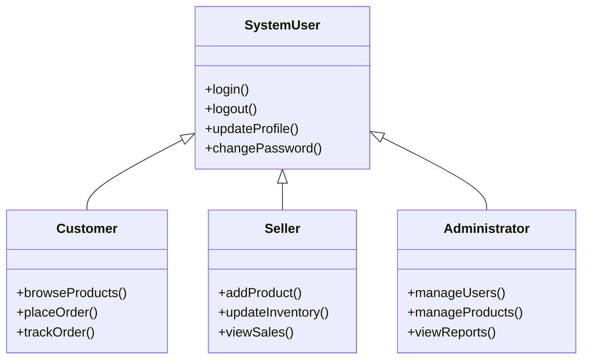
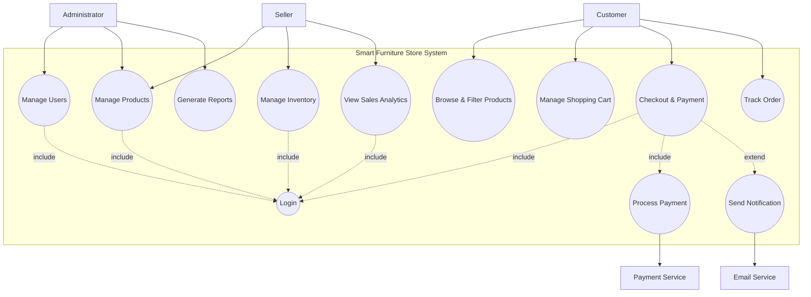

# 4. Use Case Model

## 4.1 Actor Catalog

| Actor | Type | Description | Key Goals |
|-------|------|-------------|-----------|
| Customer | Primary | Registered or guest user looking for furniture | Browse products, manage cart, place and track orders |
| Seller | Primary | Furniture vendor or store owner | Manage product listings, track inventory, view sales |
| Administrator | Primary | System overseer and manager | Manage users, monitor system health, generate reports |
| Payment Service | Secondary | External simulated payment gateway | Process and validate transaction details |
| Email Service | Secondary | External notification system | Deliver order confirmations and status updates |

### Actor Generalization

All actors share common authentication behavior (login, logout, profile management). Each role adds specific capabilities tailored to their interaction with the Smart Furniture Store.

---

## 4.2 Use Case Diagram

**Relationships explained:**
- **Include (Login):** Most primary actions require the user to be authenticated.
- **Include (Process Payment):** The Checkout process cannot be completed without the payment processing step.
- **Extend (Send Notification):** After a successful checkout, the system optionally sends an email notification to the customer.

---

## 4.3 Use Case Descriptions

### UC-005: Checkout & Payment (Fully Dressed)

| Field | Detail |
|-------|--------|
| **Use Case ID** | UC-005 |
| **Name** | Checkout & Payment |
| **Actor** | Customer |
| **Description** | The customer reviews their cart, provides shipping details, and completes the purchase. |
| **Preconditions** | Customer is logged in; at least one item is in the shopping cart. |
| **Postconditions** | Order is created; inventory is updated; payment is confirmed; customer receives a receipt. |
| **Trigger** | Customer clicks the "Checkout" button in the shopping cart. |

**Main Success Scenario:**

| Step | Action |
|------|--------|
| 1 | Customer reviews the items and total price in the shopping cart. |
| 2 | Customer clicks "Proceed to Checkout." |
| 3 | System displays shipping address form (pre-filled if available). |
| 4 | Customer confirms shipping details and selects a payment method. |
| 5 | System requests payment authorization from the Payment Service. |
| 6 | Payment Service confirms successful transaction. |
| 7 | System creates an order record and updates product inventory levels. |
| 8 | System displays an order confirmation page with a unique Order ID. |
| 9 | System triggers an email notification with the order summary. |

**Alternative Flows:**

| ID | Condition | Steps |
|----|-----------|-------|
| A1 | Guest Checkout | If the system allows, guest provides email and shipping info without logging in. (Note: Scope says login is required). |
| A2 | Apply Discount Code | At step 1, customer enters a valid coupon. System recalculates the total price. |

**Exception Flows:**

| ID | Condition | Steps |
|----|-----------|-------|
| E1 | Payment Declined | System notifies the customer: "Payment failed. Please check your card details or try another method." |
| E2 | Item Out of Stock | At step 2, if an item became unavailable, system alerts: "Sorry, [Product Name] is no longer in stock." and updates the cart. |
| E3 | Invalid Shipping Info | System highlights missing fields and prevents proceeding until corrected. |

**Business Rules:**
- Orders cannot be placed for zero or negative totals.
- Inventory must be reserved temporarily during the checkout session.
- Payment simulation must return a "Success" or "Failure" status.

---

### UC-002: Manage Products (Fully Dressed)

| Field | Detail |
|-------|--------|
| **Use Case ID** | UC-002 |
| **Name** | Manage Products |
| **Actor** | Seller, Administrator |
| **Description** | Allows sellers or admins to add, edit, or remove furniture products from the store. |
| **Preconditions** | User is logged in with Seller or Admin privileges. |
| **Postconditions** | Product catalog is updated; changes are visible to customers. |
| **Trigger** | User navigates to the "Product Management" section in their dashboard. |

**Main Success Scenario:**

| Step | Action |
|------|--------|
| 1 | User selects "Add New Product." |
| 2 | System displays a form for product details (Name, Category, Price, Description, Images, Stock). |
| 3 | User fills in the details and uploads product images. |
| 4 | User clicks "Save Product." |
| 5 | System validates the input (required fields, valid price, image format). |
| 6 | System saves the product to the database and associates it with the Seller. |
| 7 | System displays confirmation: "Product added successfully." |

**Alternative Flows:**

| ID | Condition | Steps |
|----|-----------|-------|
| A1 | Edit Existing Product | User selects an existing product, modifies fields, and saves changes. |
| A2 | Delete Product | User selects "Delete." System asks for confirmation before removing the product. |

**Exception Flows:**

| ID | Condition | Steps |
|----|-----------|-------|
| E1 | Missing Required Fields | System prevents saving and highlights empty fields (e.g., "Price is required"). |
| E2 | Invalid Image Format | System displays: "Only JPG and PNG formats are supported." |

---

### UC-003: Browse & Filter Products (Brief)

| Field | Detail |
|-------|--------|
| **Use Case ID** | UC-003 |
| **Name** | Browse & Filter Products |
| **Actors** | Customer (Guest or Registered) |
| **Description** | User explores the furniture catalog using categories, search keywords, and filters (price range, material, etc.). |
| **Main Flow** | 1) User enters the store → 2) System displays featured products and categories → 3) User enters a search term or selects a category → 4) User applies filters (e.g., Price < $500) → 5) System updates the product list in real-time. |
| **Preconditions** | None (available to all visitors). |
| **Postconditions** | User finds desired products to view details or add to cart. |

---

